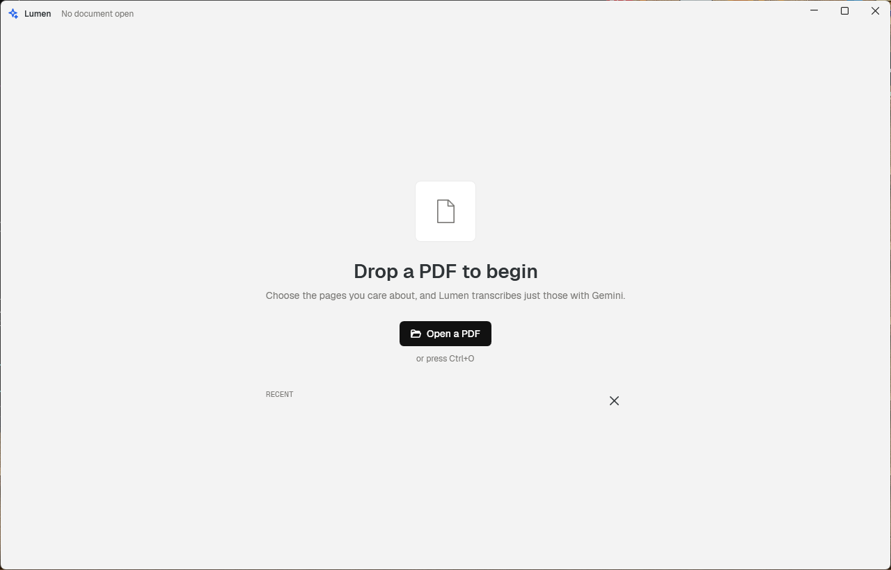
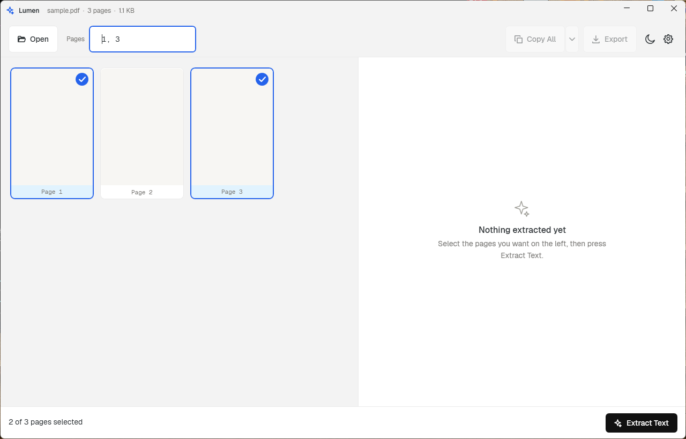
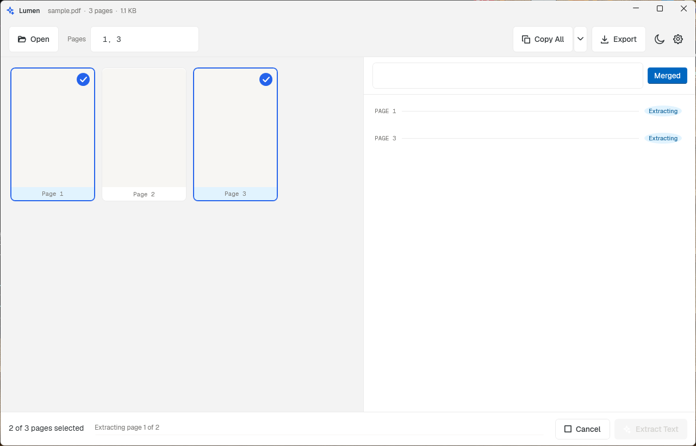
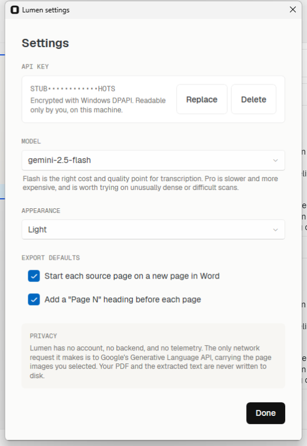
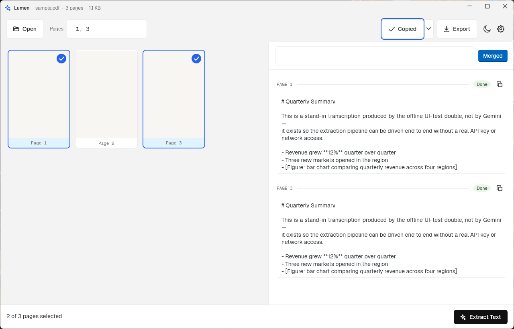
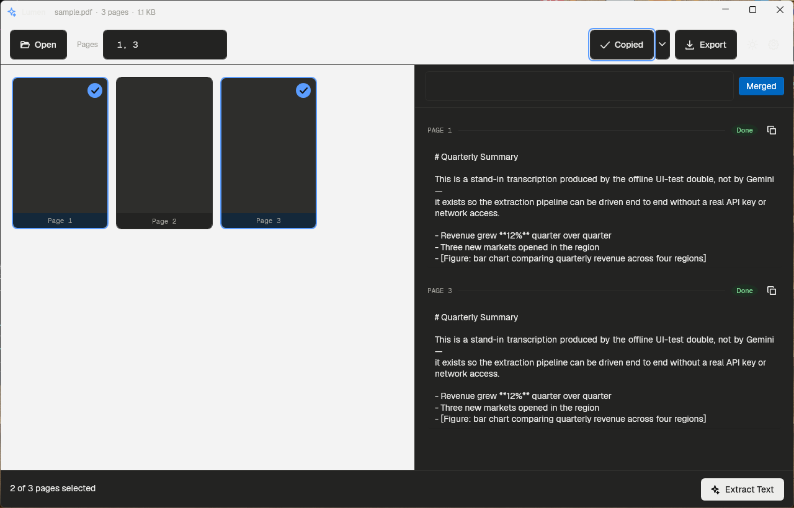

# Lumen

A native Windows desktop app that reads PDFs and transcribes the pages you select using the
Google Gemini API. Open a PDF, click the pages you care about, press **Extract Text**, then copy
the result or export it to a real Word document.

No backend, no account, no telemetry. The only network call anywhere in the app goes to
`generativelanguage.googleapis.com`.



## Install

1. Build the installer yourself — see [Build from source](#build-from-source) below. `dist/` is
   gitignored, so `Lumen-Setup-1.0.0.exe` isn't checked into this repo; `.\build.ps1` produces it
   locally in a few minutes.
2. Run the resulting `dist\Lumen-Setup-1.0.0.exe`. It installs entirely per-user — no admin
   rights needed, nothing installed system-wide.
   Choose "Install for me only" on the mode screen.
3. Leave "Create a desktop shortcut" and "Open PDF files with Lumen" unticked unless you want
   them; both default off.
4. On first launch, Lumen asks for a Gemini API key. Get a free one from
   [Google AI Studio](https://aistudio.google.com/apikey) and paste it in — it's validated before
   being saved, and stored encrypted on your machine (Windows DPAPI) where only your Windows user
   account can read it. It never leaves this machine except in the API request itself.

### "Windows protected your PC"

The installer and the app are **not code-signed** — that costs money Lumen doesn't spend yet — so
Windows SmartScreen will likely flag the installer on first run with a blue "Windows protected
your PC" screen. This is expected, not a sign anything is wrong. Click **More info**, then
**Run anyway**. A commented-out `SignTool` block is already sitting in `build.ps1` for when a
signing certificate is available.

## What it does



- **Open a PDF** by dragging it onto the window, the Open button, or `Ctrl+O`. Password-protected
  files prompt for a password instead of crashing. The last 10 files you opened are listed on the
  start screen.
- **Select pages** on a virtualized thumbnail grid — click, `Ctrl`-click, `Shift`-click, rubber-band
  drag, or type a range like `1-5, 12, 20-24` into the page-range box. Fully keyboard-operable,
  with Narrator announcing each page's selection state.
- **Extract** the pages you picked. Each is rendered to PNG and sent to Gemini
  (`gemini-2.5-flash` by default, `gemini-2.5-pro` selectable in Settings) with instructions to
  transcribe verbatim, render tables as markdown, preserve headings, and describe figures in a
  bracketed note rather than skip them. Up to 4 pages run concurrently, with per-page retry on
  failure and a Cancel button wired to a real cancellation token.

  

- **Read the result** as one continuous merged document (a per-page Cards view is also available),
  find text with `Ctrl+F`, and jump between the page grid and the results by clicking either side.
- **Copy** any page, or all of them, with one click — the button morphs into a "Copied"
  confirmation. Copy All offers formatted, markdown, or plain-text output.

  

- **Export to Word** with real `Heading 1/2/3` styles, real tables with borders, real numbered
  lists, and bold/italic preserved — built with the Open XML SDK, not Word Interop, so it works
  without Word installed. Markdown and plain-text export are also available from the same dialog.
  Page breaks between source pages and a "Page N" heading per page are both on by default and
  changeable per export.

## Settings, and both themes



Light and dark themes are both fully designed, following the Windows system theme by default with
a manual override that persists. Mica backdrop is used where the OS supports transparency effects,
with a solid fallback otherwise.

| Light | Dark |
|---|---|
|  |  |

## Architecture

The solution is split on one rule: **`Lumen.Core` never references WPF.** Everything testable —
page-range parsing, DPAPI secret storage, the Gemini client and retry policy, markdown parsing,
the Word/Markdown/plain-text exporters, and PDF rendering (via PDFtoImage/PDFium, returning PNG
**bytes**, never a `BitmapSource`) — lives there, targeting plain `net8.0`. `Lumen.App` is the WPF
shell: MVVM with CommunityToolkit.Mvvm, WPF-UI for Fluent/Mica chrome, and a three-layer design
token system (primitive → semantic → component) enforced by a unit test that fails the build if a
hex color literal appears outside `Themes/Primitives.xaml`.

Packaging publishes `Lumen.App` as a **self-contained, single-file, ReadyToRun** `win-x64`
executable — the user installs nothing else, not even the .NET runtime — wrapped by an
**Inno Setup 6** installer that installs per-user with no admin prompt (`installer/Lumen.iss`).
`build.ps1` runs the whole pipeline and, critically, doesn't just check that the native PDFium/Skia
DLLs exist after publish — it actually launches the published exe with a hidden
`--self-test-render` switch and renders a real PDF page through it, because single-file publishing
changes how native libraries load in ways `dotnet run` never exercises.

By deliberate decision (recorded in `docs/superpowers/specs/2026-08-21-lumen-design.md`), Lumen
does **not** try to read a PDF's native text layer before falling back to Gemini — every selected
page goes through the same Gemini transcription path, digitally-native or scanned alike. That
keeps the extraction pipeline uniform and the cost/behavior predictable, at the cost of paying for
an API call on pages that a text-layer extraction could technically have answered for free.

## Build from source

Requires the .NET 8 SDK and, for the installer step, [Inno Setup 6](https://jrsoftware.org/isdl.php).

```powershell
dotnet build -c Release      # build everything
dotnet test tests/Lumen.Core.Tests   # 178 unit tests, no UI needed
.\build.ps1                  # publish, verify the native gate, build the installer
```

`build.ps1` publishes self-contained/single-file/ReadyToRun, runs the native-DLL gate described
above, locates `iscc.exe` (checked across PATH, Program Files, and
`%LOCALAPPDATA%\Programs`, since a per-user Inno Setup install lands there), and drops
`Lumen-Setup-<version>.exe` into `dist/`. Pass `-SkipInstaller` to publish without Inno Setup
installed.

### Testing

- `tests/Lumen.Core.Tests` — xUnit + FluentAssertions, no UI, runs anywhere. Covers page-range
  parsing, DPAPI round-tripping and log redaction, the Gemini request builder/retry policy/error
  mapper, markdown parsing and stripping, the Word exporter's actual OpenXML output, PDF
  rendering, and the design-token discipline check.
- `tests/Lumen.UiTests` — FlaUI.UIA3, drives the real built app through Windows UI Automation:
  the API key gate, opening a PDF, a non-contiguous page selection, extraction, the copy
  confirmation, and the export dialog. It runs against an offline stub instead of the real Gemini
  API (set via `LUMEN_UI_TEST=1`, see `StubGeminiHandler`), so it needs no API key and makes no
  network calls, but it does need a real Windows desktop session to drive.
- `tools/ScreenshotTool` — not a test; a re-runnable utility (`dotnet run --project
  tools/ScreenshotTool`) that drives the real app the same way to regenerate the screenshots in
  this README.

## Known limitations

- **Unsigned binaries.** See the SmartScreen section above.
- **Every page goes through Gemini**, including PDFs with a perfectly good native text layer —
  see Architecture above for why that's a deliberate tradeoff, not an oversight.
- **No `win-arm64` build yet.** The spec allows for it if it's a one-line change; it wasn't
  attempted in this pass.
- **Session-only.** Neither the opened PDF nor extracted text is ever written to disk — closing
  Lumen or crashing loses unsaved work in progress, by design (nothing you haven't exported was
  ever persisted in the first place).
